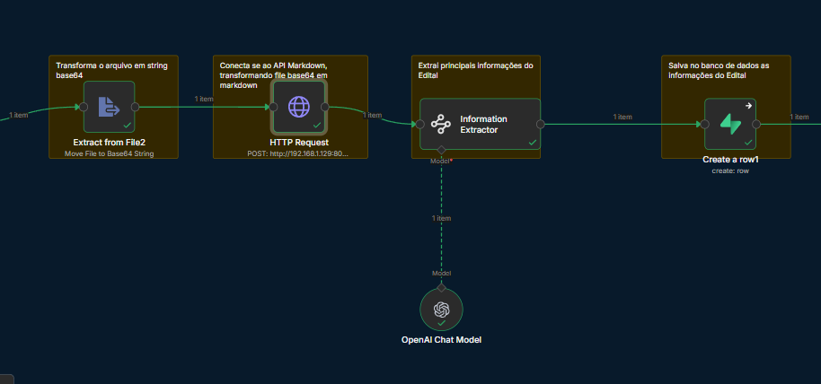
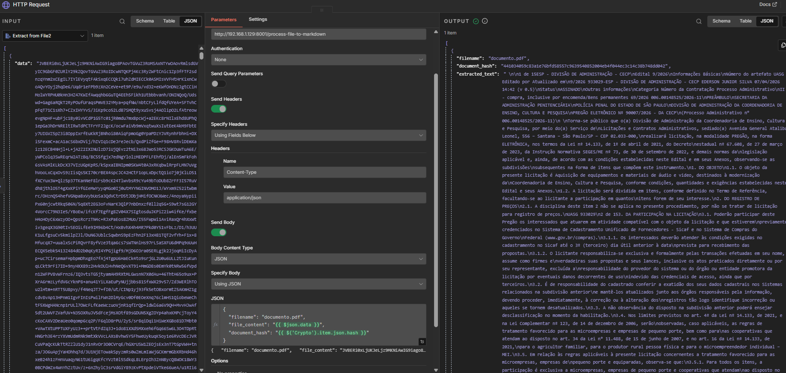

(# Markdown API (PDF → Text/Markdown + Structured Data)

English | [Português](README.pt-BR.md)

This API automates PDF document processing by:
- receiving a PDF (commonly as Base64 from n8n),
- extracting text,
- generating formatted Markdown,
- and returning a JSON payload that can be used by downstream extractors (LLMs) and databases.

## Example output
See: `examples/output.example.json`

## n8n workflow usage
This API is designed to run inside an n8n workflow:

1. Convert file to Base64 (n8n node)
2. HTTP Request → calls this API
3. Information extractor (LLM) → extracts key fields
4. Database insert

## n8n workflow usage
### API node (HTTP Request)

### Parameters example

## Request/Response (overview)
- Input: PDF file content (Base64) + optional filename
- Output: JSON with `filename`, `document_hash`, `extracted_text`, `markdown_content`, `success`, `error`

## Notes
- Large PDFs can produce large payloads. Consider storing the full extracted text externally if needed.
